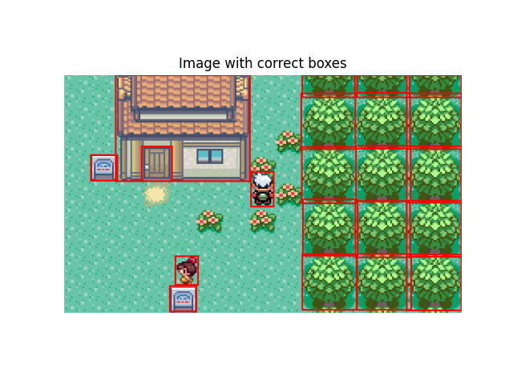
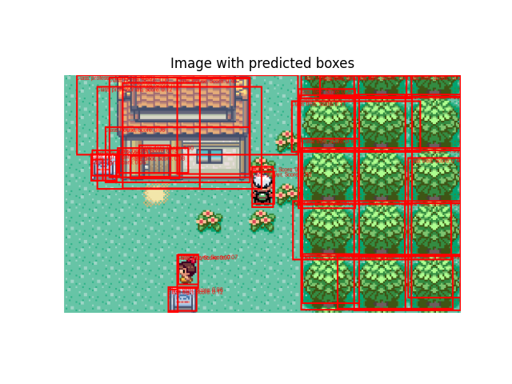
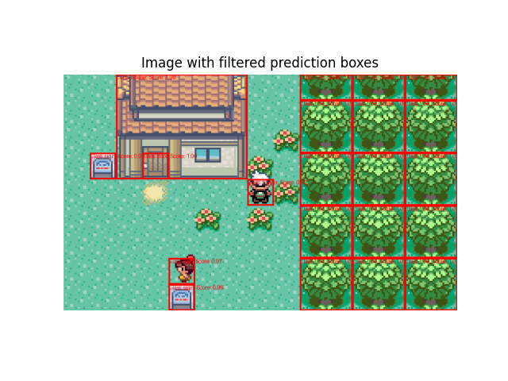

# GRIDEYE
GRIDEYE is a subproject of the ARES project responsible for the overworld viewing and object detection. GRIDEYE has two main purposes:
- Screenshot the emulator window and perform any image processing so it is ready for the object detection model
- Use an object detection model to detect different objects on the screen such as NPCs and obstacles and returns the environment state represented as a 2D array of integers

## Prediction Process
1. Processed image is given to object detection model as input with a shape of `740x432`

2. Object detection model returns list of object detections each with its bounding box, class label, and score

3. Bounding boxes are rounded to the nearest tile
4. Object detections are filtered based on the following criteria:
    - If multiple objects have the same bounding box, the one with the highest score is kept and the rest are removed
    - Scores less than `0.8` are removed

5. Initial grid (2D array) is created and filled with ones
6. For each detected object after filtering, the indices in the 2D array are calculated based on the bounding box location and an integer is assigned to the spots the box covers with the appropriate value for the predicted class

For the images above, this is the correct resulting state:
```
[[1. 1. 0. 0. 0. 0. 0. 1. 1. 0. 0. 0. 0. 0. 0.]
 [1. 1. 0. 0. 0. 0. 0. 1. 1. 0. 0. 0. 0. 0. 0.]
 [1. 1. 0. 0. 0. 0. 0. 1. 1. 0. 0. 0. 0. 0. 0.]
 [1. 7. 0. 3. 0. 0. 0. 1. 1. 0. 0. 0. 0. 0. 0.]
 [1. 1. 1. 1. 1. 1. 1. 5. 1. 0. 0. 0. 0. 0. 0.]
 [1. 1. 1. 1. 1. 1. 1. 1. 1. 0. 0. 0. 0. 0. 0.]
 [1. 1. 1. 1. 1. 1. 1. 1. 1. 0. 0. 0. 0. 0. 0.]
 [1. 1. 1. 1. 2. 1. 1. 1. 1. 0. 0. 0. 0. 0. 0.]
 [1. 1. 1. 1. 7. 1. 1. 1. 1. 0. 0. 0. 0. 0. 0.]]
```
